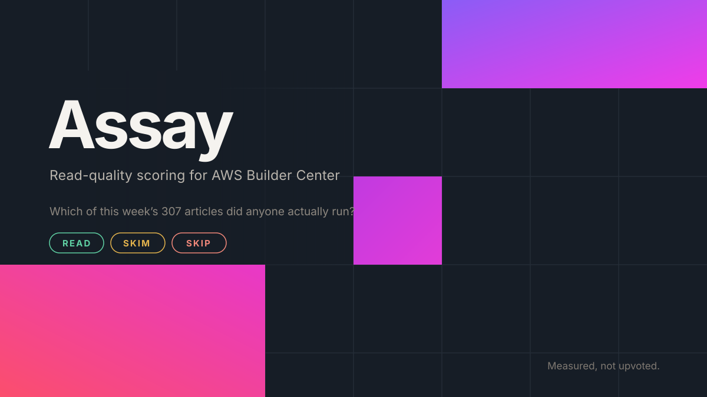
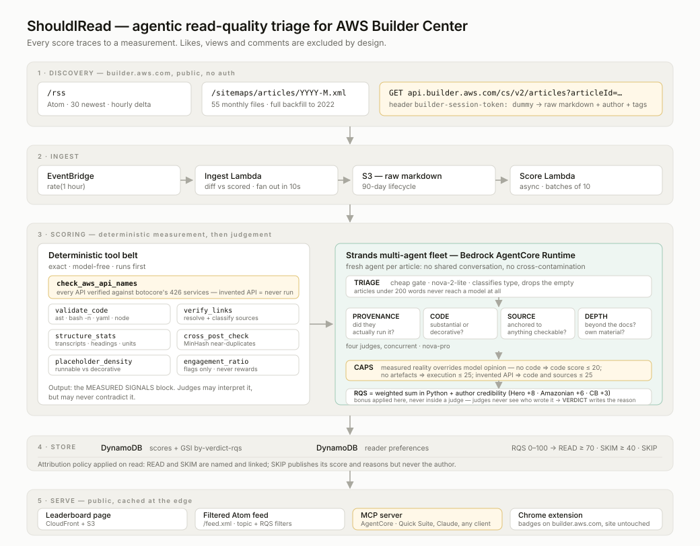

# Assay



**Read-quality scoring for [AWS Builder Center](https://builder.aws.com).** An assay is the test
that tells you how much actual metal is in an ore; this one tells you how much substance is in an
article.

Builder Center publishes around **307 articles a week**. Nothing on the site tells you which are
worth opening, and the signal it does show you carries no information about quality — across a full
week (n = 302), likes correlate with measured quality at **r = −0.09**, and the top 20 by likes and
the top 20 by score share *zero* articles.

Assay gives every article a **Read-Quality Score** (RQS, 0–100) and a verdict — `READ` · `SKIM` ·
`SKIP` — plus one blunt sentence explaining it, and tells authors exactly what would raise theirs.

**Live:** <https://d1m5fcrjmmi9ue.cloudfront.net>

| endpoint | |
|---|---|
| `/` | leaderboard, filterable by verdict and topic |
| `/review.html` | **paste your own article, get ranked recommendations** |
| `/api/review?url=` | the same, as JSON |
| `/feed.xml` | filtered Atom feed (`?min_rqs=70&topics=bedrock,eks`) |
| `/api/queue` | ranked reading queue as JSON |
| `/api/score/{id}` | one article's full breakdown |
| `/api/stats` | corpus statistics |
| `/scores.json` | score index the browser extension reads |



## What it actually measures

The question is the reader's — *is this worth my time?* — not *can the author prove they ran it*.
Being written with AI assistance is not a defect. Being empty is.

Handing an article to a model and asking whether it is any good reproduces the exact failure
being detected: models reward fluency, and fluent-but-empty is the thing to catch. So eight
deterministic tools run before any model does, and their output is ground truth the judges may
interpret but never contradict:

| tool | what it establishes |
|---|---|
| `check_aws_api_names` | every `boto3` call, `aws` CLI invocation and API name is checked against **botocore's index of 426 AWS services**. An operation that exists in no SDK was never checked against reality. |
| `aws_footprint` | which services are **operated** versus merely named — client constructions, API calls, CloudFormation and Terraform resources, ARNs, IAM statements, quota mentions |
| `validate_code` | syntax-only checks: `ast.parse`, `bash -n`, `yaml.safe_load`, `node --check`. Nothing from an article is ever run. |
| `verify_links` | every outbound link resolved and classified: primary source, repo, community, dead |
| `structure_stats` | pasted terminal sessions, real headings vs bold-text pseudo-headings, measurements with units, placeholder density |
| `find_artifacts` | linked repositories, published packages, live demos — durable proof the work exists |
| `cross_post_check` | MinHash near-duplicate detection across the corpus, including the same body under a *different* author |
| `engagement_ratio` | wired one way only: engagement can never raise a score, it can only flag a thin post carrying implausible likes |

Then a Strands multi-agent fleet on Bedrock AgentCore scores **fifteen dimensions**,
grouped into four families. The question every one of them serves is the reader's —
*is this worth my time?* — not *can you prove you ran it*.

| family | weight | dimensions |
|---|---|---|
| **Content** — is there anything here? | 35 | substance 9 · explanation depth 7 · insight 10 · accuracy 6 · scope discipline 3 |
| **AWS** — useful to an AWS builder? | 28 | service depth 10 · architecture quality 7 · well-architected 5 · currency 3 · cost awareness 3 |
| **Evidence** — can it be trusted? | 22 | evidence 9 · sources 6 · code quality 7 |
| **Reader** — can it be used? | 15 | clarity 8 · actionability 7 |

Fifteen dimensions, but only **four judge calls** — each judge returns its whole
family in one structured response. Granularity for the author-facing advice
without paying for it in tokens.

An earlier version weighted proof-of-execution at 30 and scored a substantial
project write-up as SKIM for linking a repository instead of pasting a terminal
session. Execution proof is now one signal inside `evidence`, weighted to the
strength of the claims made: an opinion piece needs none, a claimed 10x speedup
needs the measurement. Judges are told to calibrate against what the article is
*trying to be* — a news post, an explainer and a deep dive succeed differently.

### Author credibility

Authors who carry accountability for what they publish get an explicit bonus on
the finished score — AWS Heroes are vetted and renewed annually, Amazon employees
write under their employer's name:

| author | bonus |
|---|---|
| AWS Hero | +8 |
| Amazon employee | +6 |
| Community Builder | +3 |
| community | 0 |

Three properties make this safe to have:

- **It is applied to the final score, never inside a judge.** The author's status
  is deliberately withheld from the judges' evidence block. If a judge knew who
  wrote a piece it would inflate five separate rationales invisibly; as one
  number it is auditable — `base_rqs` and `author_bonus` are stored separately
  and shown in the score breakdown.
- **It cannot rescue an evidence-free post.** No bonus applies below the SKIM
  floor (`SIR_BONUS_FLOOR`, default 40).
- **It cannot turn SKIP into READ on its own.** The largest bonus applied at the
  SKIM floor still lands short of the READ threshold; a test asserts this.

Tune with `SIR_BONUS_HERO`, `SIR_BONUS_AMAZONIAN`, `SIR_BONUS_CB`,
`SIR_BONUS_FLOOR`. Set them all to `0` to score purely on evidence.

**The RQS is arithmetic, not a model output.** Judges score their own dimensions; the weighted
sum happens in Python. And every dimension is *capped* by what was measured — services named but
never operated hold `aws_service_depth` at 49; an API that exists in no SDK holds `code_quality`
at 29 and `accuracy` at 35, however persuasive the prose. That guardrail is what makes the score
hard to talk your way past.

Caps are demanded by content type, not universally. An opinion piece with no citations is not
penalised; a reference article asserting facts with none is. An article containing no code is not
capped at all — it simply is not the kind of article code was expected from.

### Stability

An LLM judge whose variance you have not measured is a judge whose scores you cannot
interpret. Scoring one article five times, at temperature 0, originally gave:

| | single sample | + median of 3 | + score bands |
|---|---|---|---|
| stdev | 13.4 | 6.4 | **0.7** |
| spread | 32.0 | 14.2 | **1.5** |
| worst single-dimension spread | 80 | 40–70 | **5** |
| verdict stable? | no (SKIM↔READ) | no | **yes** |

Measured against the rubric of the time, one sample returned **0** for evidence on an article
containing five pasted terminal sessions, then 80 a minute later.

Two fixes, in the order that mattered. Each judge is sampled `SIR_JUDGE_SAMPLES` times
(default 3) and the per-dimension **median** is taken, with the disagreement recorded in
`signals.sample_spread`. And **every one of the fifteen dimensions** now carries explicit score
bands anchored to the measured counts — judgement operates inside a band, never to move between
bands. The bands did most of the work; more compute alone did not fix it.

```bash
python analysis/stability.py --samples 5                 # measure it yourself
python analysis/stability.py --samples 5 --judge-samples 1   # without the median
python analysis/likes_vs_quality.py --run week           # do likes predict quality?
```

`stability.py` exits non-zero if the verdict changes across identical runs.

## Quick start

```bash
uv venv --python 3.13 && uv pip install -e ".[dev]"

# score one article
assay score https://builder.aws.com/content/<id>/<slug>

# score the 15 most recent articles from a rolling 3-day window (the default corpus)
assay run --run latest --days 3 --limit 15

# build the leaderboard and the filtered feed
assay report --run latest
assay page   --run latest
assay feed   --run latest --min-rqs 70 --topics bedrock serverless
```

## Recommendations: turning the score into advice

Scoring answers "is this worth reading?". The more useful question for an author is **what would
move it**, and the caps make that computable rather than hand-wavy.

```console
$ assay review https://builder.aws.com/content/<id>/<slug>

  Weekend Agent Challenge: Opportunity Finder Agent
  RQS 50/100 -> SKIM   (20 points from READ)
  addressing everything below reaches about 75 (READ)

  already working:
    + 4 code blocks parse cleanly
    + includes complete runnable files

  recommendations, highest impact first:

  1. Support the claims you are making   [~4.0 RQS]
     evidence - proportionate to the claims
     Not every article needs terminal output - but every claim needs something
     behind it. Show the measurement for results, and say plainly what you did
     not test.

  2. Cite the factual claims   [~3.9 RQS]
     sources and citations

  3. Operate the services, do not just name them   [~3.5 RQS]
     AWS depth - operating or naming
     One parameter that mattered, a quota you hit, an IAM condition or a cost
     figure is worth more than another paragraph describing a service.

  [= exact: this cap is provably costing that much]
  [~ estimate: realistic headroom on that dimension]
```

Because the weights and caps are deterministic, a binding cap has an **exact** price. A cap holding
`sources` at 50 when the judge wanted 85 costs precisely `(85 − 50) × 6 / 100 = 2.1` RQS.
Recommendations are ranked by what they are actually worth rather than by how important they
sound, and marked `exact` or `estimate` so the difference is visible.

Available four ways: the `assay review` CLI command (accepts a local draft or a published URL), the
`/review.html` page, `GET /api/review?url=`, and the `review_article` MCP tool.

A test asserts that **every cap the scorer can emit has matching advice**, so a new cap cannot ship
as a finding nobody can act on.

## Surfaces

Every surface applies the same `Preferences` filter, so the feed and the browser extension
can never disagree.

**The published site is built through Assay's own MCP server.** `publish_site.py` seeds
DynamoDB, then reads the corpus back out via the `export_corpus` MCP tool and renders the
leaderboard, feed and extension index from that — over stdio by default, or against the
deployed AgentCore runtime with `--via agentcore`. It is not decoration: if the MCP tools
ever drift from what the pages show (a different filter, a lapsed attribution rule) the
publish step breaks loudly instead of the two quietly disagreeing. Use `--via direct` to
bypass it.

```bash
python scripts/publish_site.py --run week --replace                  # via local MCP
python scripts/publish_site.py --run week --via agentcore            # via hosted MCP
```

- **Leaderboard** — static page on CloudFront + S3, filterable by verdict and topic
- **Atom feed** — `/feed.xml`, filtered by topic, minimum RQS, author kind and age
- **MCP server** — nine tools: `get_reading_queue`, `score_url`, `review_article`,
  `explain_score`, `search_scored`, `set_preferences`, `get_preferences`, `export_corpus`,
  `corpus_stats`. Runs over stdio locally, or streamable HTTP on AgentCore Runtime for
  Quick Suite and any other MCP client.
- **Chrome extension** — MV3 content script that injects score badges onto builder.aws.com
  cards and article pages. Purely additive; the site itself is untouched.

```bash
python -m shouldiread.mcp_server            # stdio
python -m shouldiread.mcp_server --http     # :8000/mcp, AgentCore shape
```

See [docs/connect-mcp.md](docs/connect-mcp.md) for Quick Suite, Claude Desktop and
raw SigV4 connection details.

## Attribution policy

Articles scoring `READ` or `SKIM` are **named and linked** — naming good work is the point.
Articles scoring `SKIP` publish their score and their reasons but **never the author or
title**. The aggregate problem is worth being blunt about; individual community members are
not the target. This is enforced in one place (`publish._public`) and covered by tests that
assert redacted titles never reach the rendered HTML or the feed.

## How content is read

All public, no scraping tricks and no login:

- `/rss` — Atom, 30 newest, hourly. The delta source.
- `/sitemaps/articles/YYYY-M.xml` — 55 monthly files back to 2022. Full backfill.
- `api.builder.aws.com/cs/v2/articles?articleId=…` with the header
  `builder-session-token: dummy` — the literal anonymous token builder.aws.com's own web app
  sends for logged-out readers. Returns raw markdown, which is far better for scoring than
  rendered HTML.

Article pages themselves are a 2.5 KB SPA shell with no server-rendered body, so HTML
scraping yields nothing and no headless browser is used in production. Requests are rate
limited and concurrency-capped; `robots.txt` disallows only `/profile/`.

## Deploy

```bash
cd infra && cdk deploy                      # S3, CloudFront, API GW, Lambdas, DynamoDB
python infra/deploy_agentcore.py build      # push arm64 images
python infra/deploy_agentcore.py deploy     # scorer + MCP runtimes
```

Bedrock access note: on the account this was built against, every Anthropic inference profile
returns `ResourceNotFoundException`, so scoring runs on Nova (`nova-2-lite` for triage,
`nova-pro` for the judges). Swap the ids in `config.py` if your account differs.

## Tests

```bash
pytest
```

Covers the tool belt against real-article fixtures (including the assertion that an invented
`s3.turbo_upload_object` is flagged while ordinary non-AWS Python is not), the scoring caps,
preference filtering, and the attribution policy.
